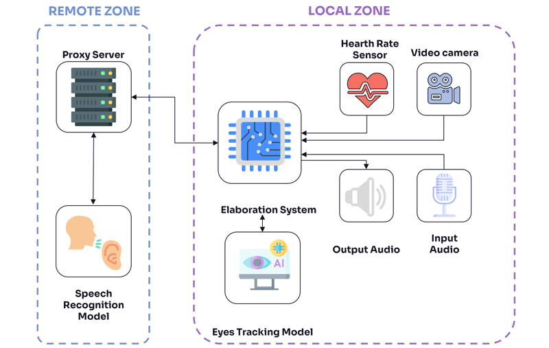

# Table of Contents

- [Table of Contents](#table-of-contents)
- [Introduction](#introduction)
- [Architecture](#architecture)
- [State of the Art](#state-of-the-art)
- [Main Components](#main-components)
- [Performance Evaluation](#performance-evaluation)
  - [Tested Models](#tested-models)
  - [Key Findings](#key-findings)
- [Conclusion](#conclusion)

# Introduction
An intelligent system that autonomously assesses passengers' physiological and neurological status immediately after a vehicle crash. It integrates cardiac sensors, camera, microphone, and voice interaction to perform a simplified automated Glasgow Coma Scale (GCS) evaluation.

# Architecture
Data is processed locally on a Raspberry Pi 3B+, with an optional remote server running the Whisper AI model for advanced voice recognition. The system combines vital signs and behavioral data to provide a fast triage report, ensuring low latency, privacy, and resilience.

# State of the Art
This project aligns with industry and academic efforts focusing on post-crash health monitoring using multimodal sensors and AI, following European regulations such as Euro NCAP Vision 2030.

# Main Components
- Polar T34 heart rate sensor  
- Raspberry Pi camera for eye-tracking and facial recognition  
- USB microphone for voice commands  
- Raspberry Pi 3B+ for local processing  
- Remote server for Whisper-based voice recognition

# Performance Evaluation

The application was developed considering the limited hardware resources of the Raspberry Pi 3 Model B+. To ensure functionality without relying on network connectivity (4G, 5G, Wi-Fi), most computations are performed locally on the device.

Two deployment configurations were tested:
- **Local computation:** Entire application, including the Whisper speech recognition model, runs on the Raspberry Pi.
- **Remote computation:** The Whisper model runs on a remote server to offload the Raspberry Pi.

## Tested Models
- **Tiny and Base:** Evaluated both locally and remotely.
- **Large:** Tested only remotely due to high computational demands.

## Key Findings

- **Camera FPS:**  
  Local execution of heavier models drastically reduces the camera frame rate, impairing real-time video acquisition. Tiny and Base models show similar impacts locally due to system resource limits. Remote execution maintains higher FPS close to hardware limits.

- **Inference Time:**  
  User interaction time is consistent across configurations. Local processing increases transcription elaboration time, especially for the Base model. Remote processing significantly reduces this latency.

- **Resource Usage:**  
  Swap usage remains low in all cases. Local inference of Tiny and Base models consumes substantial RAM and CPU, nearing device limits. Remote inference lowers memory footprint and CPU usage.

- **CPU Distribution:**  
  Without the GUI, more CPU cycles are available for Whisper and video processing modules, improving performance. The GUI component (`labwc`) accounts for significant CPU overhead on constrained hardware.

# Conclusion

The system effectively balances local processing and remote computation to handle the Raspberry Pi 3B+ hardware limits, ensuring reliable operation even without network connectivity. Lightweight models enable feasible on-device inference, while more complex models require remote offloading. Optimizing resource allocation, such as disabling the GUI, improves performance. Overall, a hybrid distributed approach provides an efficient, scalable solution for embedded multimodal health monitoring in resource-constrained environments.
